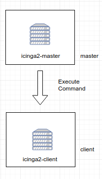
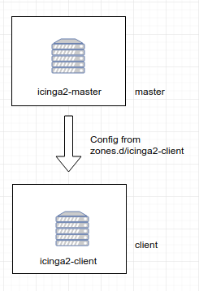

## Zones
Icinga2 chia làm các zones có quan hệ parent-child.  
Các thành viên trong child zone không được gửi câu lệnh cấu hình tới các thành viên trong parent zone.  

## Endpoints
Mỗi node thuộc 1 zones được gọi lfa Endpoint objects. Tất cả các Endpoint trong 1 zone sẽ đáp ứng High avaibility.  

## ApiListener
Được dùng để tải chứng chỉ SSL và chỉ định các hạn chế.  
File cấu hình: `/etc/icinga2/features-enabled/api.conf`  
Kích hoạt: `icinga2 feature enable api`  

## Security
icinga2 cung cấp cơ chế bảo mật:  
- Bắt buộc sử dụng SSL để giao tiếp giữa các node.  
- Các child zone chỉ nhận update cho các đối tượng được cấu hình.  
- Child zone không được phép update cấu hình tới parent zone.  
- Các zone không thể can thiệp vào các zone khác và ảnh hưởng lẫn nhau. Mỗi host or service chỉ được gán cho 1 zone.  
- Tất cả các node trong zone tin tưởng lẫn nhau.  

## Master Setup
Setup Wizard  
```
root@Master:/home/congnt# icinga2 node wizard
Welcome to the Icinga 2 Setup Wizard!

We will guide you through all required configuration details.

Please specify if this is a satellite/client setup ('n' installs a master setup) [Y/n]: n

Starting the Master setup routine...

Please specify the common name (CN) [Master]: Master 
Reconfiguring Icinga...
Checking for existing certificates for common name 'Master'...
Certificates not yet generated. Running 'api setup' now.
Generating master configuration for Icinga 2.
Enabling feature api. Make sure to restart Icinga 2 for these changes to take effect.
Please specify the API bind host/port (optional):
Bind Host []: 
Bind Port []: 

Done.

Now restart your Icinga 2 daemon to finish the installation!
```
Restart icinga2
```
systemctl restart icinga2
```
Khóa public và private được lưu trong thư mục `/var/lib/icinga2/ca`  
Tạo ticket trên master node  
```
root@Master:/home/congnt# icinga2 pki ticket --cn Client
cfdd1cbbe89f598404c1fb3e36f79d587202ff6d
```
Đầu ra sẽ là một chuỗi giống như trên `cfdd1cbbe89f598404c1fb3e36f79d587202ff6d`  

## Client/Satellite Setup
Trên client setup wizard  
```
root@Client:/home/congnt# icinga2 node wizard
Welcome to the Icinga 2 Setup Wizard!

We will guide you through all required configuration details.

Please specify if this is a satellite/client setup ('n' installs a master setup) [Y/n]: 

Starting the Client/Satellite setup routine...

Please specify the common name (CN) [Client]: Client

Please specify the parent endpoint(s) (master or satellite) where this node should connect to:
Master/Satellite Common Name (CN from your master/satellite node): Master

Do you want to establish a connection to the parent node from this node? [Y/n]: 
Please specify the master/satellite connection information:
Master/Satellite endpoint host (IP address or FQDN): 192.168.148.131 
Master/Satellite endpoint port [5665]: 5665            

Add more master/satellite endpoints? [y/N]: 
Parent certificate information:

 Subject:     CN = Master
 Issuer:      CN = Icinga CA
 Valid From:  Nov 30 12:49:33 2017 GMT
 Valid Until: Nov 26 12:49:33 2032 GMT
 Fingerprint: 22 57 CE BD EF 4F 93 97 F8 99 D3 9F 03 C3 18 03 6B 90 AF 59 

Is this information correct? [y/N]: y

Please specify the request ticket generated on your Icinga 2 master (optional).
 (Hint: # icinga2 pki ticket --cn 'Client'): cfdd1cbbe89f598404c1fb3e36f79d587202ff6d

Please specify the API bind host/port (optional):
Bind Host []: 
Bind Port []: 

Accept config from parent node? [y/N]: y
Accept commands from parent node? [y/N]: y

Reconfiguring Icinga...
Disabling feature notification. Make sure to restart Icinga 2 for these changes to take effect.
Enabling feature api. Make sure to restart Icinga 2 for these changes to take effect.

Done.

Now restart your Icinga 2 daemon to finish the installation!
```
Restart icinga2  
```
systemctl restart icinga2
```
Kiểm tra kết nối giữa các node
```
netstat | grep :5665
```

## Configuration Modes
Có nhiều cách khác nhau để đảm bảo rằng các node Icinga2 thực hiện kiểm tra, gửi thông báo... Nhưng thông thường người ta cấu hình các đối tượng monitoring trên master và phân phối các đối tượng này tới satellites và clients.  
### Top Down 
Có 2 hành vi trong việc thực hiện check:  
- Gửi lệnh thực thi từ xa: Trình lập lịch vẫn chạy trên parent node.  
- Đồng bộ các host/service trực tiếp với child node: Check được thực hiện cục bộ.  

### Top Down Command Endpoint
Chế độ này buộc node Icinga thực hiện các lệnh từ xa trên Endpoint được chỉ định. Cấu hình host/service nằm trên master, satellite và client chỉ cần các định nghĩa đối tượng CheckCommand đang được sử dụng ở đó.  
  
Ưu điểm:  
- Không cần định nghĩa check trên child node.  
- Thực hiện check từ xa light-weight.  
- Không cần replay node cho child node.  
- Pin check tới các Endpoint.  

Nhược điểm:  
- Nếu không thể kết nối tới child node sẽ không thể thực hiện check.  
- Yêu cầu các thuộc tính cấu hình bổ sung cho host/service.  
- Yêu cầu cấu hình CheckCommand cục bộ. Nên sử dụng Global config.  

Để đảm bảo tất cả các node chấp nhận cấu hình và câu lệnh, ta cần cấu hình Zone và Endpoint trên tất cả các node.  
Trên tất cả các node cấu hình Zone và Endpoint trong file `/etc/icinga2/zones.conf`  
```
object Endpoint "icinga2-master" {
  host = "192.168.66.166"
}

object Endpoint "icinga2-client" {
  host = "192.168.66.131"
}

object Zone "master" {
  endpoints = [ "icinga2-master" ]
}

object Zone "icinga2-client" {
  endpoints = [ "icinga2-client" ]
  parent = "master"
}
```

Disable thư mục conf.d trong file `/etc/icinga2/icinga2.conf` trên Client
```
//include_recursive "conf.d" 
```
Restart Icinga2 trên tất cả các node  
```
systemctl restart icinga2
```
Tạo thư mục zone chứa cấu hình
```
mkdir -p /etc/icinga2/zones.d/icinga2-master
```
Thêm các host, service muốn monitor.
```
root@Master:~# vim /etc/icinga2/zones.d/icinga2-master/hosts.conf

object Host "icinga2-client" {
  check_command = "hostalive"
  address = "192.168.66.131"

  vars.client_endpoint = name
}

root@Master:~# vim /etc/icinga2/zones.d/icinga2-master/services.conf

apply Service "disk" {
  check_command = "disk"

  command_endpoint = host.vars.client_endpoint

  assign where host.vars.client_endpoint
}
```
Restart cấu hình Master
```
systemctl restart icinga2
```

### Top Down Config Sync
Chế độ này sẽ đồng bộ hóa các tập tin cấu hình trong các vùng được chỉ định, hữu ích nếu ta muốn cấu hình tất cả mọi thứ trên node master và đồng bộ nó xuống các client. Client sẽ thực hiện các lệnh này và gửi trả lại kết quả.  
  
Ưu điểm:  
- Đồng bộ hóa các tập tin cấu hình từ parent zone xuống child zone.  
- Không có yêu cầu khởi đồng lại bằng tay trên child node.  
- Thực hiện kiểm tra trực tiếp trên scheduler của child node.  
- Replay log nếu kết nối bị drop.  
- Sử dụng global zone để đồng bộ hóa.  

Nhược điểm:  
- Yêu cầu một thư mục config trên master noode với tên của zone name bên dưới.  
- Yêu cầu thêm cấu hình cấu hình Zone và Endpoint.  
- Khi được kết nối lại sau khi mất kết nối, Replay log được replicate.  

Để đảm bảo tất cả các node chấp nhận cấu hình và câu lệnh, ta cần cấu hình Zone và Endpoint trên tất cả các node.
Trên tất cả các node cấu hình Zone và Endpoint trong file `/etc/icinga2/zones.conf`
```
object Endpoint "icinga2-master" {
  host = "192.168.66.166"
}

object Endpoint "icinga2-client" {
  host = "192.168.66.131"
}

object Zone "master" {
  endpoints = [ "icinga2-master" ]
}

object Zone "icinga2-client" {
  endpoints = [ "icinga2-client" ]
  parent = "master"
}
```
Restart Icinga2 trên tất cả các node
```
systemctl restart icinga2
```
Trên Master tạo thư mục cùng tên với child zone
```
mkdir -p /etc/icinga2/zones.d/icinga2-client
```
Thêm các host, service muốn monitor.
```
root@icinga2-master:~# vim /etc/icinga2/zones.d/icinga2-client/hosts.conf
object Host "icinga2-client" {
  check_command = "hostalive"
  address = "192.168.66.131"
  zone = "master"
}

root@icinga2-master:~# vim /etc/icinga2/zones.d/icinga2-client/services.conf
object Service "disk" {
  host_name = "icinga2-client"
  check_command = "disk"
}
```
Restart icinga trên master
```
systemctl restart icinga2
```

