## Install Icinga2
Cài đặt Icinga2 trên Ubuntu 16.04  
Add icinga repo  
```
wget -O - https://packages.icinga.com/icinga.key | apt-key add -
echo 'deb https://packages.icinga.com/ubuntu icinga-xenial main' >/etc/apt/sources.list.d/icinga.list
apt-get update
```
Cài đặt icinga2  
```
apt-get install icinga2
```
Cài đặt plugin monitor  
```
apt-get install monitoring-plugins
```
Cấu hình syntax highlight trong vim
```
apt-get install vim-icinga2 vim-addon-manager
vim-addon-manager -w install icinga2
```

## Install Icinga Web 2
Cài đặt apache, mysql, php7
```
apt-get install mysql-server php7.0 libapache2-mod-php7.0
```
Cài đặt module IDO cho MySQL
```
apt-get install icinga2-ido-mysql
```
No --> Yes --> Điền password cho icinga2 ido-mysql --> Ok  
Sử dụng MySQL là DB backend cho icinga  
```
icinga2 feature enable ido-mysql command
```
Restart icinga
```
systemctl restart icinga2
```
Cài đặt icinga web
```
apt-get install icingaweb2
```
Set timezone trong file `/etc/php/7.0/apache2/php.ini` tìm dòng `;date.timezone = ` và sửa thành
```
date.timezone = Asia/Ho_Chi_Minh
```
Restart apache
```
/etc/init.d/apache2 restart
```

## Cấu hình Icinga Web
Trên trình duyệt vào trang `http://<IP>/icingaweb2/setup`  
Icinga Web 2 yêu cầu cung cấp token, sử dụng lệnh sau để tạo token  
```
icingacli setup token create;
```
Điền token và chọn Next.  
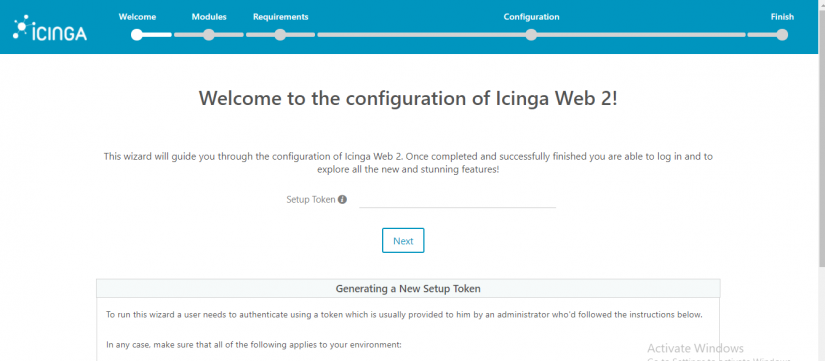  
Bước tiếp theo chọn các module để kích hoạt, ở đây chỉ chọn module monitoring.  
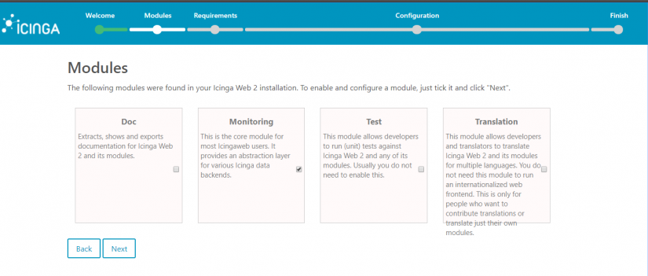  
Kiểm tra các gói PHP cần thiết  
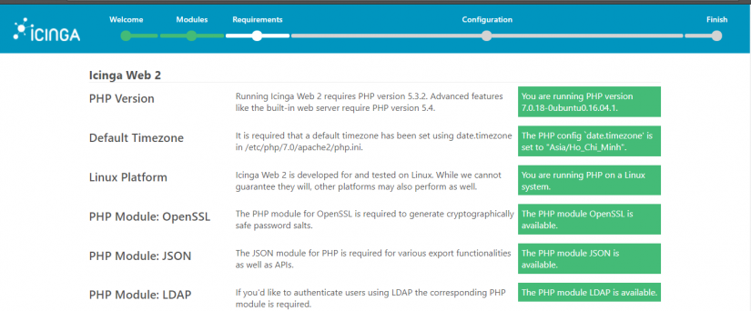  
Chọn kiểu xác thực cho Icinga2. Chọn database.  
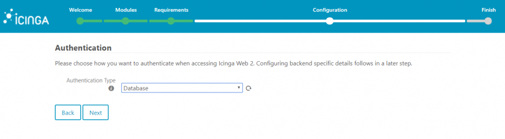  
Tạo database cho IcingaWeb2  
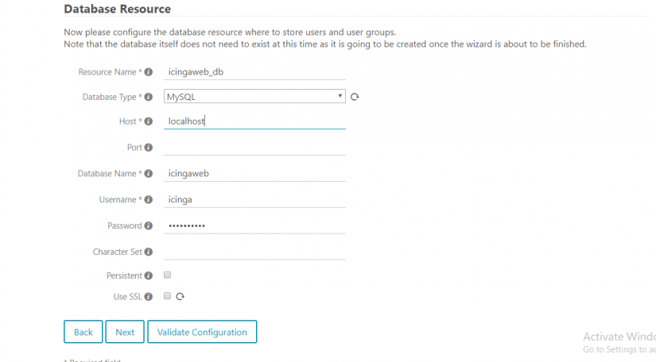  
Điền user & password root của mysql  
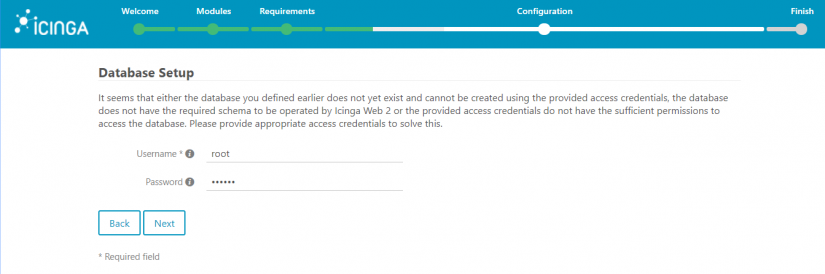  
Cung cấp tên DB backend  
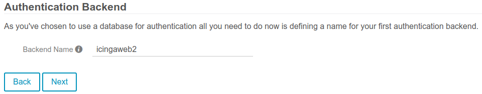  
Tạo tài khoảng đăng nhập IcingaWeb2  
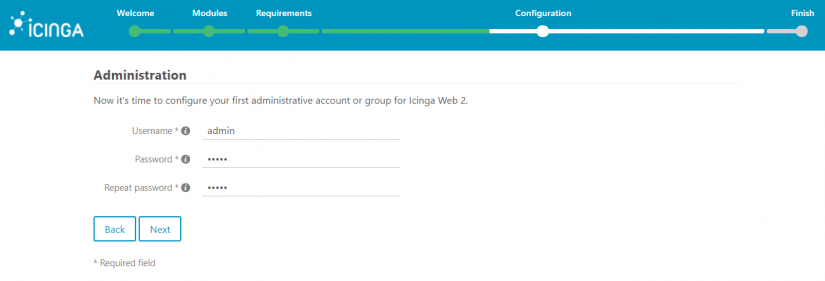  
Cấu hình log  
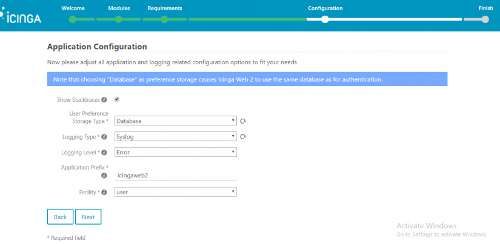  
Verify cấu hình  
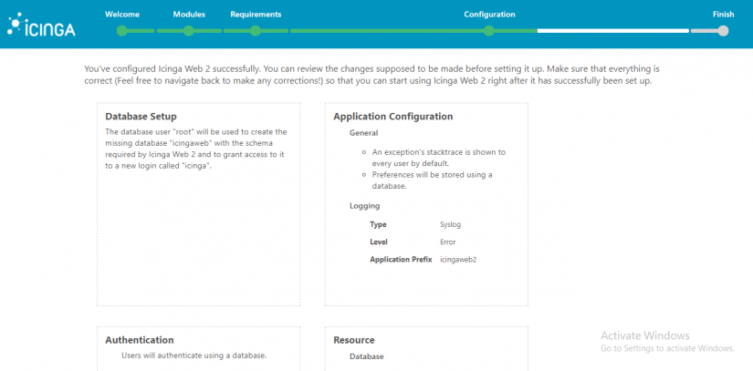  
Cấu hình monitoring backend  
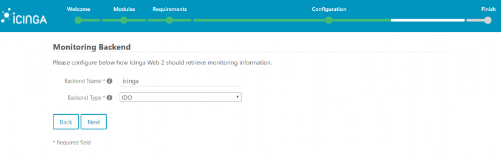  
Điền các thông tin trong file `/etc/icinga2/features-enabled/ido-mysql.conf` vào  
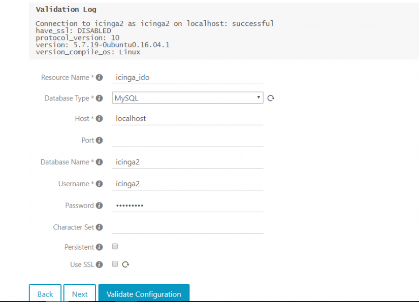  
Chọn kiểu send command  
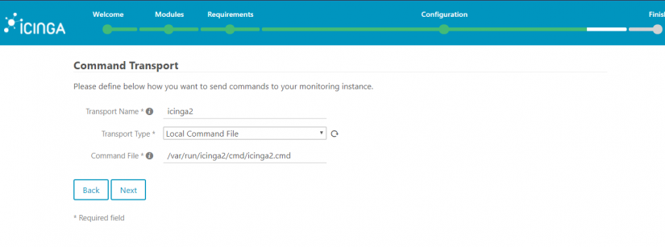  
Chọn kiểu security  
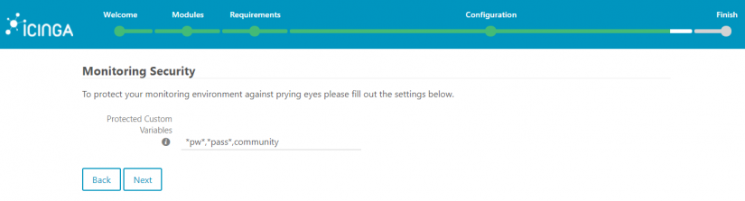  
Verify cấu hình  
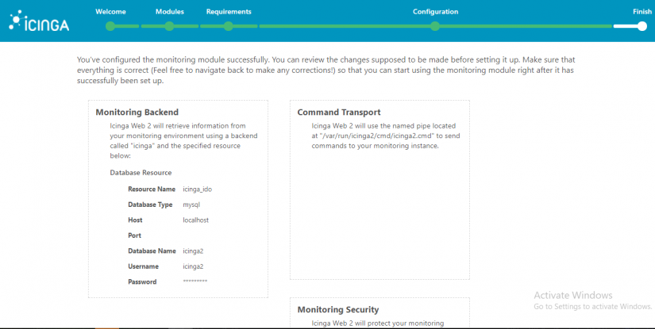  

