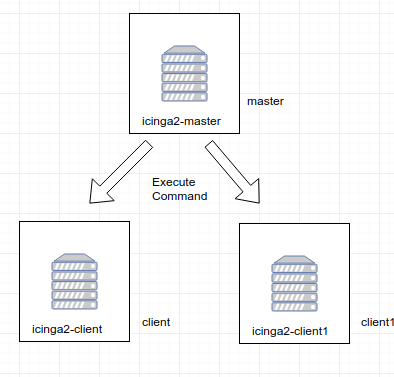
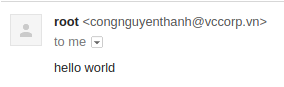
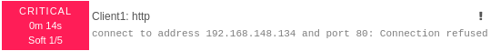
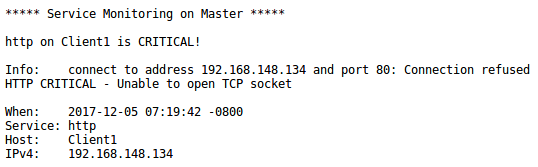

# Mô hình
  

## Cài đặt wizard trên các node
### Master
```
root@icinga2-master:~# sudo icinga2 node wizard
Welcome to the Icinga 2 Setup Wizard!

We will guide you through all required configuration details.

Please specify if this is a satellite/client setup ('n' installs a master setup) [Y/n]: n

Starting the Master setup routine...

Please specify the common name (CN) [icinga2-master]: 
Reconfiguring Icinga...
Checking for existing certificates for common name 'icinga2-master'...
Certificates not yet generated. Running 'api setup' now.
Generating master configuration for Icinga 2.
Enabling feature api. Make sure to restart Icinga 2 for these changes to take effect.
Please specify the API bind host/port (optional):
Bind Host []: 
Bind Port []: 

Done.

Now restart your Icinga 2 daemon to finish the installation!
```
Restart icinga2
```
service icinga2 restart
```
Trên master tạo ticket cho các client
```
root@icinga2-master:~# icinga2 pki ticket --cn 'icinga2-client'
65d3f9d74d9255b8d32a61fae37c0eced045b1c0
root@icinga2-master:~# icinga2 pki ticket --cn 'icinga2-client1'
d7eb5e442870655407dd2f0a3eadb14c79f1cce1
```

### Client
```
root@icinga2-client:~# icinga2 node wizard
Welcome to the Icinga 2 Setup Wizard!

We will guide you through all required configuration details.

Please specify if this is a satellite/client setup ('n' installs a master setup) [Y/n]: 

Starting the Client/Satellite setup routine...

Please specify the common name (CN) [icinga2-client]: 

Please specify the parent endpoint(s) (master or satellite) where this node should connect to:
Master/Satellite Common Name (CN from your master/satellite node): icinga2-master

Do you want to establish a connection to the parent node from this node? [Y/n]: 
Please specify the master/satellite connection information:
Master/Satellite endpoint host (IP address or FQDN): 192.168.148.131
Master/Satellite endpoint port [5665]: 5665

Add more master/satellite endpoints? [y/N]: 
Parent certificate information:

 Subject:     CN = icinga2-master
 Issuer:      CN = Icinga CA
 Valid From:  Nov 30 02:25:03 2017 GMT
 Valid Until: Nov 26 02:25:03 2032 GMT
 Fingerprint: 0E 10 AA D9 A5 63 AD C5 FC 5B A0 BA 35 0E 33 34 05 63 E5 15 

Is this information correct? [y/N]: y

Please specify the request ticket generated on your Icinga 2 master (optional).
 (Hint: # icinga2 pki ticket --cn 'icinga2-client'): 65d3f9d74d9255b8d32a61fae37c0eced045b1c0

Please specify the API bind host/port (optional):
Bind Host []: 
Bind Port []: 

Accept config from parent node? [y/N]: y
Accept commands from parent node? [y/N]: y

Reconfiguring Icinga...

Done.

Now restart your Icinga 2 daemon to finish the installation!

```
Restart icinga2
```
service icinga2 restart
```

### Client1
```
root@icinga2-client:~# icinga2 node wizard
Welcome to the Icinga 2 Setup Wizard!

We will guide you through all required configuration details.

Please specify if this is a satellite/client setup ('n' installs a master setup) [Y/n]: 

Starting the Client/Satellite setup routine...

Please specify the common name (CN) [icinga2-client]: icinga2-client1    

Please specify the parent endpoint(s) (master or satellite) where this node should connect to:
Master/Satellite Common Name (CN from your master/satellite node): icinga2-master

Do you want to establish a connection to the parent node from this node? [Y/n]: Y
Please specify the master/satellite connection information:
Master/Satellite endpoint host (IP address or FQDN): 192.168.148.131
Master/Satellite endpoint port [5665]: 5665

Add more master/satellite endpoints? [y/N]: 
Parent certificate information:

 Subject:     CN = icinga2-master
 Issuer:      CN = Icinga CA
 Valid From:  Nov 30 02:25:03 2017 GMT
 Valid Until: Nov 26 02:25:03 2032 GMT
 Fingerprint: 0E 10 AA D9 A5 63 AD C5 FC 5B A0 BA 35 0E 33 34 05 63 E5 15 

Is this information correct? [y/N]: y

Please specify the request ticket generated on your Icinga 2 master (optional).
 (Hint: # icinga2 pki ticket --cn 'icinga2-client1'): d7eb5e442870655407dd2f0a3eadb14c79f1cce1

Please specify the API bind host/port (optional):
Bind Host []: 
Bind Port []: 

Accept config from parent node? [y/N]: y
Accept commands from parent node? [y/N]: y

Reconfiguring Icinga...

Done.

Now restart your Icinga 2 daemon to finish the installation!
```
Restart icinga2
```
service icinga2 restart
```

## Cấu hình Agent Monitoring
Tạo thư mục trên master
```
mkdir -p /etc/icinga2/zones.d/icinga2-master
```
Định nghĩa services check
```
root@icinga2-master:~# vim /etc/icinga2/zones.d/icinga2-master/services.conf
apply Service "load" {
  import "generic-service"
  check_command = "load"
  command_endpoint = host.vars.client_endpoint
  assign where host.vars.client_endpoint
}

apply Service "procs" {
  import "generic-service"
  check_command = "procs"
  command_endpoint = host.vars.client_endpoint
  assign where host.vars.client_endpoint
}

```
Nó sẽ tạo ra 2 service check là CPU load và số process trên server. Dòng `command_endpoint` cho icinga biết service này cần gửi tới remote command endpoint. Dòng `assign where` sẽ gán service check cho mọi host có client_endpoint được xác định.  
Tạo các hosts
```
root@icinga2-master:~# vim /etc/icinga2/zones.d/icinga2-master/icinga2-client.conf
object Zone "icinga2-client" {
  endpoints = [ "icinga2-client" ]
  parent = "icinga2-master"
}

object Endpoint "icinga2-client" {
  host = "192.168.148.134"
}

object Host "icinga2-client" {
  import "generic-host"
  address = "192.168.148.134"
  vars.http_vhosts["http"] = {
    http_uri = "/"
  }
  vars.notification["mail"] = {
    groups = [ "icingaadmins" ]
  }
  vars.client_endpoint = name
}

root@icinga2-master:~# vim /etc/icinga2/zones.d/icinga2-master/icinga2-client1.conf
object Zone "icinga2-client1" {
  endpoints = [ "icinga2-client1" ]
  parent = "icinga2-master"
}

object Endpoint "icinga2-client1" {
  host = "192.168.148.135"
}

object Host "icinga2-client1" {
  import "generic-host"
  address = "192.168.148.135"
  vars.http_vhosts["http"] = {
    http_uri = "/"
  }
  vars.notification["mail"] = {
    groups = [ "icingaadmins" ]
  }
  vars.client_endpoint = name
}

```
Thay đổi Object icingaadmin trong file `/etc/icinga2/conf.d/user.conf` như sau
```
object User "icingaadmin" {
  import "generic-user"

  display_name = "Nguyen Thanh Cong"
  groups = [ "icingaadmins" ]
  states = [ OK, Warning, Critical ]
  email = "congnt@vccloud.vn"
}
```
Restart icinga2
```
systemctl restart icinga2
```

## Cấu hình Email
Cài đặt ssmtp trên Master
```
sudo apt-get install ssmtp mailutils
```
Cấu hình tài khoản sẽ gửi email khi có cảnh báo
```
mailhub=smtp.gmail.com:465
UseTLS=yes
FromLineOverride=yes
AuthUser=congnguyenthanh@vccorp.vn
AuthPass=PassOfUser
```
Test thử
```
echo "hello world" | mail -s "test subject" congnguyenthanh@vccorp.vn
```
Nếu nhận được email là thành công  
  

## Test
Thử remove apache2 trên cả Client1
```
sudo apt-get remove apache2
```
Quay lại IcingaWeb ta thấy Service http của Client 1 chuyển sang trạng thái Critical và sẽ nhân được email từ congnguyenthanh@vccorp.vn tới congnt@vccloud.vn  
  
  
